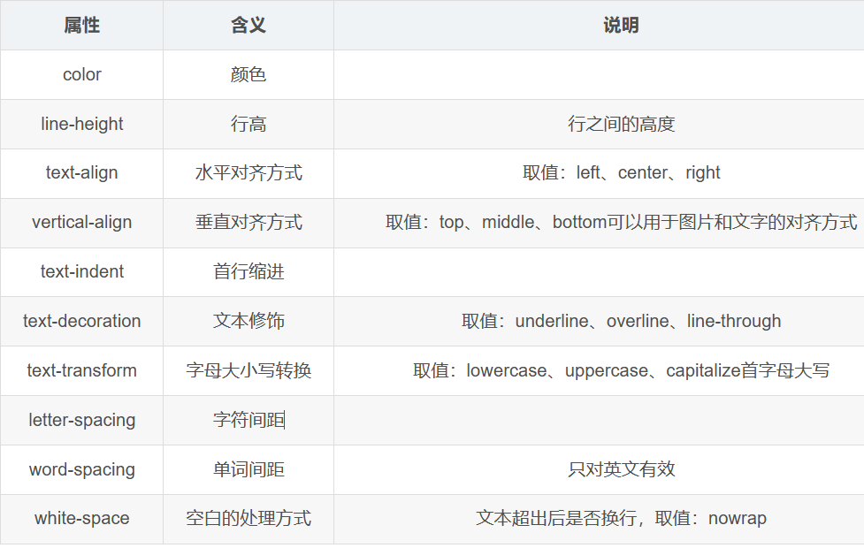
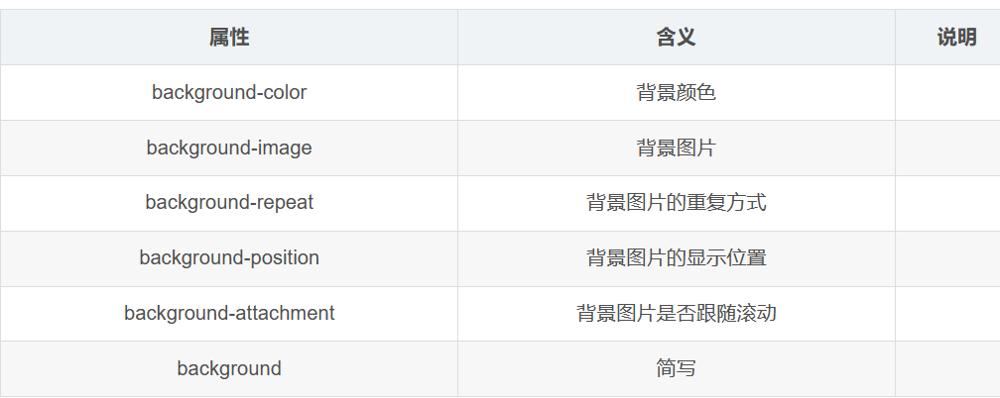
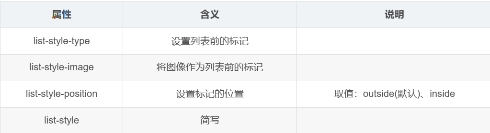

# CSS

## What is css?

CSS(Cascading Style Sheets, 层叠样式表),为 web 内容添加样式的代码.

## An example

```css
p {
    color: red;
}
```

```html
<html>
    <head>
        <title> </title>
        <style type="text/css">
            h1 {color : green; font-size : 38px}
        </style>
    </head>
    <body>
    </body>
</html>
```

`p`: Selector\
`color`: property\
`red`: property value\
`color: red`: Declaration

整个结构称为**规则集**

### 选择器(Selector)

html元素的名称位于规则集开始。它选择了一个或多个需要添加样式的元素。

### 声明(Declaration)

一个单独的规则，用来指定添加样式元素的属性。

### 属性(Properties)

改变HTML元素样式的途径。

### 属性的值

在属性的右边，冒号后面即属性的值。

### tips

#### 每一个声明后必须接一个分号

```css
p {
  color: red;
  width: 500px;
  border: 1px solid black;
}
```

#### 可以选择多种类型的元素并为它们添加一组相同的样式

用逗号分开

```css
p,
li,
h1 {
  color: red;
}
```

### 基础选择器

#### html选择符

`p {color : red}`

#### 类选择符

可以把相同元素分类定义为不同的样式。

使用`class`属性调用类选择符

```html
selector.classname {property1 : value1;...}

定义
p.left {...}
p.right {...}
调用
<p class = "left"> </p>
<p class = "right"> </p>
```

#### ID选择符

以\#作为前缀，为单独一个元素定义样式。

```html
#note {color : green}

<h1 id = "note"> css </h1>

<p id = "note"> css </p>
```

### 复杂选择器

#### 复合选择器

标签选择器和类选择器、标签选择器和ID选择器，一起使用

必须同时满足两个条件才能应用样式

#### 组合选择器

将多个具有相同样式的选择器放在一起声明，使用逗号隔开

#### 嵌套选择器

在某个选择器内部再设置选择器，通过空格隔开

只有满足层次关系最里层的选择器所对应的标签才会应用样式。

#### 伪类选择器

根据不同的状态显示不同的样式，一般多用于 标签

四种状态：

* :link 未访问的链接
* :visited 已访问的链接
* :hover 鼠标悬浮到连接上，即移动在连接上
* :active 选定的链接，被激活

```html
<html>
    <head>
        伪类选择器
        <style>
            a:link {color : red}
            a:hover {color : blud}
            a:visited {...}
            a:active {...}
        </style>
    </head>
    <body>
        <a href="..."> 超链接 </a>
    </body>
</html>
```

#### 伪元素选择器

伪元素选择器

* :first-letter 为第一个字符的样式
* :first-line 为第一行添加样式
* :before 在元素内容的最前面添加的内容，需要配合content属性使用
* :after 在元素内容的最后面添加的内容，需要配合content属性使用

```html
<!DOCTYPE html>
<html lang="en">
<head>
    <meta charset="UTF-8">
    <meta name="viewport" content="width=device-width, initial-scale=1.0">
    <title>Document</title>
    <style>
        p:first-letter {color : red;}
        p:before {content : "ddd";} 
    </style>
</head>
<body>
    <p>2111</p>
</body>
</html>
```

### 优先级

行内样式>ID选择器>类选择器>标签选择器

原因：首先加载标签选择器,再加载类选择器，然后加载ID选择器，最后加载行内样式

后加载会覆盖先加载的同名样式

#### 内外部样式加载顺序

就近原则

原因：按照书写顺序依次加载，在同优先级的前提下，后加载的会覆盖先加载的同名样式，所以离的越近。

#### \!important

可以使用!important使某个样式有最高的优先级

### 常用css属性

#### 字体属性

| 属性        | 含义 |
| ----------- | ---- |
| font-size   | 大小 |
| font-weight | 粗细 |
| font-family | 字体 |
| font-style  | 样式 |
| font        | 简写 |

#### 文本属性



#### 颜色

* 颜色名称：使用英文单词
* 16进制的RGB值：#RRGGBB 不区分大小写
* rgb函数：rgb(red,green,blue) 每种颜色的取值范围，[0,255]
* rgba函数：rbga(red,green,blue,alpha) 可以设置透明度，alpha取值范围：[0,1] 0表示完全透明 1表示完全不透明

#### 背景属性



*  background-color
取值：transparent 透明

* background-image
必须使用url()方式指定图片的路径
如果是在css样式文件中使用相对路径，此时是相对于css文件，不是相对html文件
* background-repeat
取值：repeat(默认)，repeat-x，repeat-y,no-repeat

* background-position 默认为左上角 
  * 关键字：top、bottom、left、right、center
坐标：左上角为(0,0)坐标，向右为x正方向,向下为y正方向
* background-attachment
取值：scroll(默认)、fixed固定不动
* background
简写属性：background:background-color|background-image|background-repeat|background-position 以空格隔开，书写顺序没有要求

#### 列表属性



#### LiveReload

可以实现当保存页面文件时实时刷新浏览器

### 盒子模型

盒子模型是网页布局的基础，将页面中所有元素都看作是一个盒子，盒子都包含以下几个属性：

* width 宽度
* height 高度
* border 边框
* padding 内边距
* margin 外边距

#### border

表示盒子的边框
分成四个方向

border-top, border-right, border-left, border-bottom

每个边框有三个属性:border-top-color,border-top-width, border-top-style

##### style的取值

solid实线、dashed虚线、dotted点线、double双线、inset内嵌的3D线、outset外嵌的3D线

#### padding

表示盒子的内边距，即内容与边框之间的距离

同样也分为四个方向，也可以简写（按顺时针方向，默认上下一样，左右一样）

注意：如果上下冲突，则以上为准，如果左右冲突，则以左为准

#### margin

表示盒子的外边距，即盒子与盒子之间的距离

同样也分为四个方向，也可以简写（按顺时针方向，默认上下一样，左右一样）  

#### 盒子属性默认值

不同标签的盒子属性默认值可能不同，需要自己设置

#### 合并

### 定位