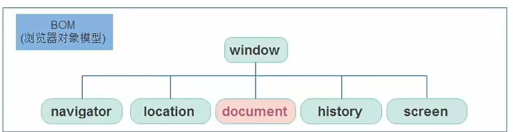
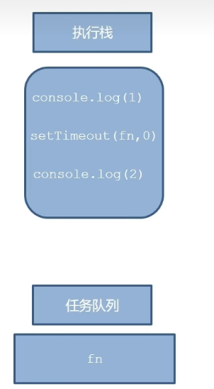

# BOM(浏览器对象模型)browser object model

bom > dom



## window对象

js中的顶级对象

```js
function fn() {
    console.log(11)
}
window.fn()

var n = 0  // var声明的挂在window下
// let和const有局部作用域
consoe.log(window.n)
```

## 定时器-延时函数

`setTimeout(回调函数，等待的毫秒数) 返回id`
仅仅执行一次

`clearTimeout(timer)`清除定时器

## js执行机制

js有两个引擎：渲染、js解析

```js
console.log(111)
setTimeout(function() {
    console.log(222)
}, 1000)
console.log(333)
// 输出 1 3 2
console.log(111)
setTimeout(function() {
    console.log(222)
}, 0)
console.log(333)
// 输出1 3 2
```

js是单线程的，所有任务需要排队，如果js执行时间过长，就会造成页面渲染不连贯，导致页面渲染加载阻塞。
为了解决这个问题，利用多核CPU的计算能力，HTML5提出了web worker标准，允许js脚本创建多个线程，于是js出现了**同步**和**异步**。

1. 同步：前一个任务结束后再执行后一个任务，程序的执行顺序与任务的排列顺序是一致的。
2. 异步：做一件事情时，因为这件事情会花费很长时间，在做这件事的同时，可以去处理其他事情。

* 同步任务：都在主线程上执行，形成一个执行栈。
* 异步任务：js的异步是通过回调函数实现的。
  * 普通事件：click、resize
  * 资源加载：load、error
  * 定时器：setInterval、settimeout
异步任务相关添加到任务队列中(也叫消息队列)


### 执行顺序

1. 先执行执行栈中的同步任务。
2. 异步任务放入任务队列中。
3. 一旦执行栈中的所有同步任务执行完毕，系统就会按次序读取任务队列中的异步任务，于是被读取的异步任务结束等待状态，进入执行栈，开始执行。

### 事件循环

由于主线程不断的重复获得任务、执行任务、再获取任务、再执行，所以这种机制被称为事件循环(event loop)

## location对象

拆分并保存了URL地址的各个组成部分

用于网页之间的跳转

```js
location.href // 当前网页的网址
location.search // 获取地址中携带的参数，符号?后面部分
location.hash // 获取#以及#后面的内容

location.reload() // 刷新页面，类似F5
// location.reload(true)
// 强制刷新，不在本地拉取数据，
```

## navigator对象

记录了浏览器自身相关的信息

看看是不是移动端还是网页端，跳转不同的网页

## history对象

主要管理历史记录，该对象与浏览器地址栏的操作相对应，如前进、后退、历史记录等。

```js
history.go(参数) 前进后退功能，如果是1，前进1个页面，如果是-1，后退一个页面
history.back()
history.forward()
```

## 本地存储

1. 数据存储在用户浏览器中
2. 设置、读取方便、甚至页面刷新不丢失数据
3. 容量较大，sessionStorage和localStorage约5m左右

### localStorage

可以将数据永久存储在本地，除非手动删除，否则关闭页面也会存在

* 可以多窗口（页面）共享（同一浏览器可以共享）
* 以键值对的形式存储使用

#### 语法

```js
key和value都是字符串
localStorage.setItem(key, value)  // 存储数据或更改数据
// 要在同一个域中
localStorage.getItem(key) // 获取数据

localStorage.removeItem(key) // 删除数据

```

### sessionStorage

1. 生命周期为关闭浏览器窗口
2. 可以多窗口（页面）共享（同一浏览器可以共享）
3. 键值对形式存储
4. 用法与localStorage基本相同

### 存储复杂数据类型

将复杂数据类型转换成json字符串，存储在本地

`JSON.stringify(复杂数据类型)`

将json转化成对象
`JSON.parse(localStorage.getItem('obj')).key`

### map方法

map可以遍历数组处理数据，并且返回新的数组

```js
const new_arr = arr.map(function(ele, index) {
    return ele + 'color'
})
```

### join方法可以把数组中的所有元素转换成一个字符串

```js
arr = [1,2,3,4]
arr.join()  // "1,2,3,4"
arr.join('') // "1234"
arr.join('|') // "1|2|3|4"
```