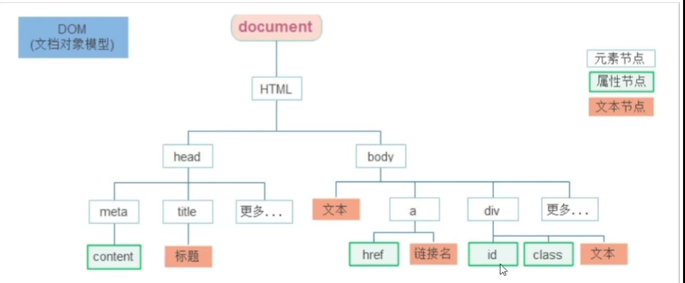

# DOM

## DOM对象

浏览器根据html标签生成的js对象。

## 获取DOM对象

```javascript
// 选择匹配的第一个元素
document.querySelector('div')
```

### 根据css选择器来获取DOM对象

```javascript
document.querySelector('div') // 选择第一个div元素  可以直接修改
document.querySelectorAll('div') // 选择所有div元素 只能遍历修改
// 得到的是一个伪数组，没有push和pop方法
```

```javascript
// id选择器
document.querySelector('#id')
// 类选择器
document.querySelector('.box')
```

## 修改DOM对象

```javascript
// 先获取DOM对象
const box = document.querySelector('.box')

box.innerText = 'new text' // 修改文本内容, 不解析内部标签
box.innerHTML = '<p>new html</p>' // 修改innerHTML, 会解析内部标签
```

### 操作常用元素属性

```javascript
对象.属性 = 值

const img = document.querySelector('img')
img.src = 'https://example.com/image.jpg' // 修改图片src属性
img.alt = 'image description' // 修改图片alt属性
```

### 操作元素样式属性

```javascript
对象.style.属性 = 值
```

### 通过类名修改样式

```javascript

对象.className = 'box' // box是类名
```

### 操作表单元素

## 自定义属性

```javascript
/* 以data-开头的属性为自定义属性 */
<div data-name="John"></div>

const div = document.querySelector('div')
div.dataset.name // "John"
```

## 定时器

```javascript
**<!-- 倒计时 -->
<!-- 开启定时器 -->
<!-- setInterval(函数, 间隔时间) -->
<!-- 每隔一段时间执行一次函数 -->
<!-- 间隔时间单位为毫秒 -->
<!-- 返回一个定时器的ID, ID会改变所以用let定义 -->
<!-- 关闭定时器 -->
<!-- clearInterval(定时器ID) -->
<body>
    <script>
        let timer_id = setInterval(function() {document.write("123")}, 1000)
        console.log(timer_id)
        clearInterval(timer_id)
    </script>
</body>
```

## 事件

### 事件监听

```javascript
对象.addEventListener('事件类型', 回调函数)

事件源：哪个DOM对象触发的事件
事件类型：鼠标点击、鼠标移动、键盘按下、页面加载完成等
回调函数：当事件发生时执行的函数
```

### 事件类型

* 鼠标事件: 鼠标触发
  * click
  * mouseenter
  * mouseleave
* 焦点事件：表单获得光标
  * focus
  * blur
* 键盘事件:键盘触发
  * keydown
  * keyup
* 文本事件：表单输入触发
  * input

## 事件对象

有事件触发时的相关信息

* 可以判断用户按下哪个键
* 可以判断鼠标点击了哪个元素

### 获取事件对象

```javascript
元素.addEventListener('click', function(e){})
```

### 常用属性

* type
* clientX/clientY
* offsetX/offsetY
* key

```javascript
trim方法：去除字符串两侧的空格
```

## 环境对象

指的是函数内部特殊的变量this,它代表着当前函数运行时所处的环境
每个函数内部都有一个this

## 回调函数

如果将函数A作为参数传递给函数B时，我们称函数A为回调函数

```javasript
function fn() {
  console.log('  w')
}
setInterval(fn, 1000)
```

## 事件流

事件流指的是事件完整执行过程中的流动路径

* 捕获阶段
* 冒泡阶段

### 事件捕获

从DOM的根元素开始去执行对应的事件(从外到里)(从大到小)

`DOM.addEventListener(事件类型,事件处理函数, 是否使用捕获机制)`
第三个参数：false代表冒泡阶段触发，默认是false

son -> father -> grandfa

### 事件冒泡

当一个元素触发事件后，会依次向上调用所有父级元素的同名事件

grandfa -> father -> son

### 阻止冒泡

`事件对象.stopPropagation()` 阻止传播

### 事件解绑

`addEventListener方式使用removeEventListener(事件类型，事件处理函数，[获取捕获或者冒泡])`

## 鼠标经过事件

* mouseover和mouseout会有冒泡效果
* mouseenter和mouseleave没有冒泡效果(推荐)

## 事件委托

利用事件流的特征解决一些开发需求的知识技巧，利用事件冒泡。

给父元素注册事件，当我们触发子元素后，会冒泡到父元素上，从而触发父元素

```javascript
ul.addEventListener('click', function() {})
ul li li li li li 
```

## 阻止默认行为

比如阻止链接的跳转，表单域跳转

```javascript
form.addEventListener('submit', function(e) {
            e.preventDefault()
        })
```

## 其他事件

### 页面加载事件

加载外部资源(如图片、外联css、JavaScript)加载完毕时触发的事件

事件名:load

给window添加load 事件

```js
window.addEventListener('load', function(){})
```

当初始的html文档被完全加载和解析完成之后，DOMContentLoaded事件被触发，而无需等待样式表、图像等完全加载
事件名：DOMContentLoaded

给document添加DOMContentLoaded事件

### 元素滚动事件

滚动条在滚动的时候持续触发的事件

事件名:scroll
监听整个页面滚动：window.addEventListener('scroll', function(){})

也可以给某个元素添加滚动事件

#### scrollLeft

被卷去的左侧

#### scrollTop

被卷去的上侧

* 获取元素内容往左、往上滚出去看不到的距离
* 可读写的:可以获得也可以赋值，数字型的，不带单位

### 页面尺寸事件

resize是浏览器页面大小发生变化时触发的事件

```javascript
window.addEventListener('resize', function() {

})
```

获取宽高：

* 获取元素的可见部分宽高(不包含边框，margin,滚动条等)
* clientWidth、clientHeight

#### 元素尺寸于位置

获取宽高：

* 获取元素自身的宽高,包含元素自身设置的宽高,padding,border
* offsetWidth、offsetHeight

offset受父亲的影响，相对于父亲的位置(如果有)

```javascript
element.getBoundingClientRect() // 返回元素的大小及其相对于视口的位置
```

## DOM节点

DOM中的每一个内容都称为节点



### 查找节点

#### 父节点查找

* parentNode属性
* 返回最近一级的父节点，否则返回null

```js
子元素.parentNode
```

#### 子节点查找

```js
父元素.children // 得到伪数组 选择的是亲儿子
```

#### 兄弟关系查找

1. 下一个兄弟 `element.nextElementSibling`
2. 上一个兄弟 `element.previousElementSibling`

做上移下移

### 新增节点

* 创建一个新节点
* 将节点添加到指定元素内部

#### 创建节点

`document.createElement()`

#### 追加节点

插入到这个元素的最后
`父元素.appendChild(元素名称)`

插入到某个子元素的前面
`父元素.insertBefore(要插入的元素，在哪个元素前面)`
ul.insertBefore(li, ul.children[0]) // 插入到一个元素前面

#### 克隆节点

`元素.cloneNode(布尔值)` // true会克隆所有子孙,false只克隆儿子

### 删除元素

必须通过父元素删除
`父元素.removeChild(要删除的元素)`