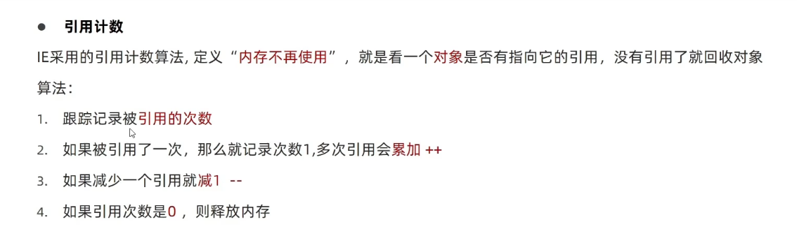
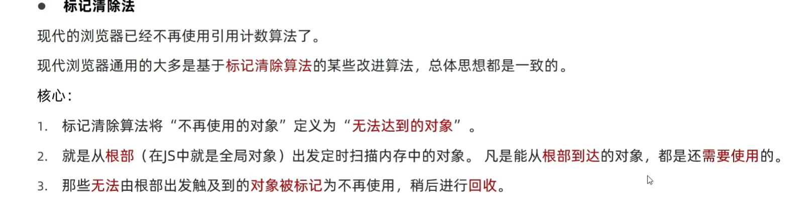

# 作用域

## 1.局部作用域

### 1.1函数作用域

内部声明的变量，外部无法访问，形参也可以看成局部变量，函数执行完毕，变量被清空

### 1.2块作用域

在js中使用{}包裹的代码成为代码块，代码块内部生命的变量外部可能无法被访问

let声明的变量会产生块作用域，var不会产生块作用域。

const声明的常量也会产生块作用域

## 2.全局作用域

`<script>`标签和.js文件的最外层就是全局作用域

## 3.作用域链

作用域链本质上是底层的变量查找机制。
在函数被执行时，会优先查找当前函数作用域中查找变量。
如果当前作用域查找不到则会依次逐级查找父级作用域直到全局作用域。

## 4.js垃圾回收机制(Garbage Collection)

js中内存的分配和回收都是自动完成的，内存在不使用的时候会被垃圾回收器自动回收

### 4.1内存分配

当我们声明变量、函数、对象时，系统会自动分配内存

### 4.2内存使用

即读写内存，也就是使用变量、函数等

### 4.3内存回收

使用完毕，由垃圾回收器自动回收不再使用的内存

全局变量一般不会自动回收，除非关闭网页

## 5.内存泄露

程序中分配的内存由于某种原因程序未释放或无法释放

## 6.堆栈

栈:由操作系统自动分配释放函数的参数值、局部变量等，基本数据类型放到栈里面

堆：一般由程序员分配释放，若程序员不释放，由垃圾回收机制回收，复杂数据类型放到堆里面

## 7.垃圾回收算法

### 7.1引用计数



#### 7.1.1嵌套引用

如果两个对象相互引用，尽管他们已经不再使用，垃圾回收器不会进行回收，导致内存泄露

```js
function fn() {
    let o1 = {}
    let o1 = {}
    o1.a = o2
    o2.a = o1
    return '引用计数无法回收'
}
fn()
```

### 7.2标记清除法



## 8.闭包

| 一个函数对周围状态的引用捆绑在一起，内层函数中访问到其外层函数的作用域
闭包 = 内层函数 + 外层函数的变量

```js
function outer() {
    const a = 1
    function inner() {
        console.log(a) // inner()用到了outer.a
    }
    inner()
}
outer()

function outer() {
            let a = 1
            function inner() {
                console.log(a)
            }
            return inner   // 返回一个函数
        }

        // outer()  === inner === function inner() {}
        const func = outer()
        func() // 调用函数 func()使用了内部outer() 的a(局部)
```

### 8.1闭包的应用

```js
// 统计函数调用次数
let i = 0
function outer() {
    i++
    console.log(`被调用了${i}次`)
}
// i是全局变量，容易被修改
// 闭包形式

function outer() {
    let i = 0   // i不会被回收
    function inner() {
        i++
        console.log(`被调用了${i}次`)
    }
    return inner
}

const func = outer()  

func() // 1
func() // 2
// 实现了数据私有
```

## 9.变量提升

仅存在于var声明的变量

当前作用域下，var声明的变量提升到当前作用域的最前面，只提升声明，不提升赋值

