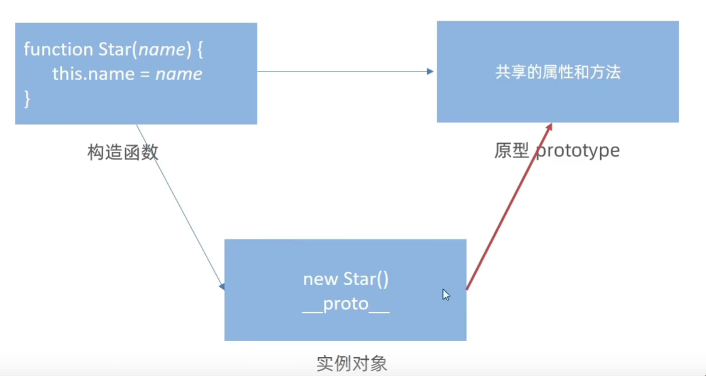
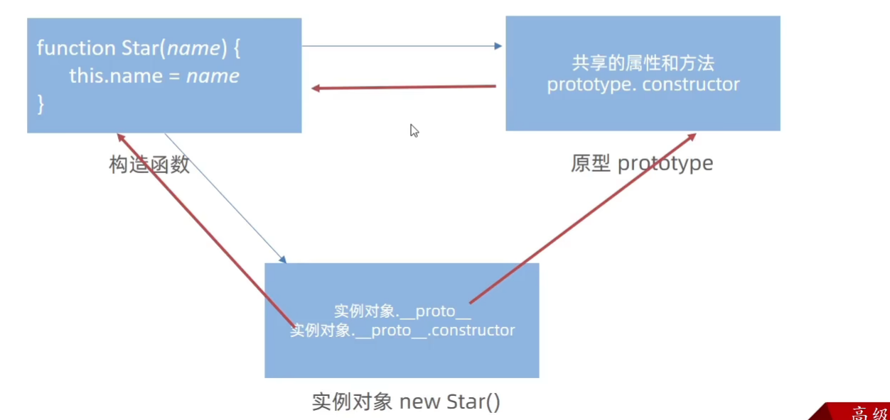
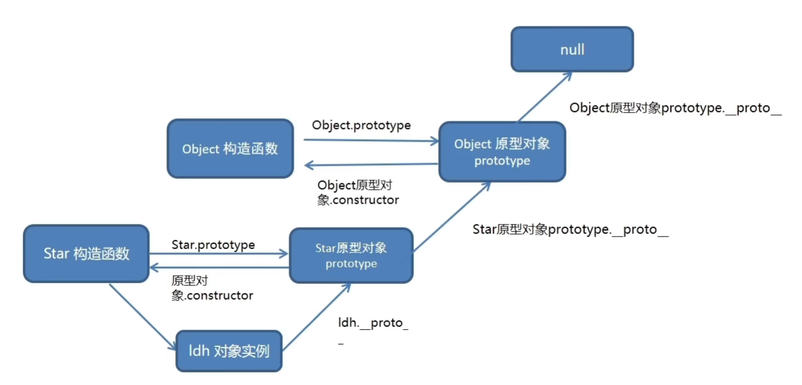
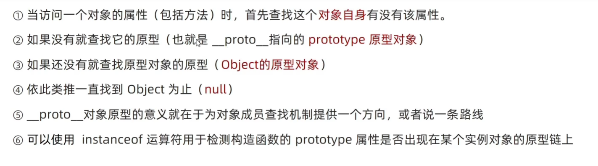

# 原型prototype

为了解决资源浪费，使用原型,共享方法和属性

构造函数通过原型分配的函数是所有对象所共享的
每一个构造函数都有一个prototype属性，指向另一个对象，我们也称为原型对象。
这个对象可以挂载函数，对象实例化不会多次创建原型上函数，节约内存。

我们可以把那些不变的方法，直接定义在prototype对象上，这样所有对象的实例可以共享这些方法。

构造函数和原型对象中的this都指向实例化对象。

```js
function Star(name, age) {
    this.name = name
    this.age = age
}

Star.prototype.sing = function() {console.log('hello world')}

const l = new Star('1', 12)
const s = new Star('2', 13)
l.sing()
s.sing()

Star.prototype = { // 这种赋值之后没有construtor,找不到原型,相当于把原来的原型覆盖了
    // 重新指回创造这个原型的构造函数
    constuctor: Star,
    sing: function() {
        
    },
    dance: function() {

    },
}
```

## constructor属性

指向该原型对象的构造函数

## 对象原型

对象都会有一个属性`__proto__`指向构造函数的`prototype`原型对象。


[[prototype]] === \_\_proto\_\_

对象原型里也有constructor指向构造函数



## 原型继承

```js
function Person() {
    this.name = "saury",
    this.age = 12
}

function Woman() {

}
Woman.prototype = new Person()
Woman.prototype.constructor = Woman // 继承之后需要将构造器指向原来的构造函数
```

## 原型链

只要是对象就有`__proto__`

Person -> Person.prototype -> Person.prototype.`__proto__` === Object.prototype -> null
          原型对象也有它的`__proto__`


### 查找规则

1. 当访问一个对象的属性和方法时，首先查找这个对象自身有没有这个属性
2. 如果没有就查找它的原型
3. 如果还没有就查找原型对象的原型
4. 一直到Object



`instanceof`检查某个对象的原型是不是在目标的原型链上

```js
function Person() {}
const s = new Person() 
console.log(s instanceof Person) // true
```