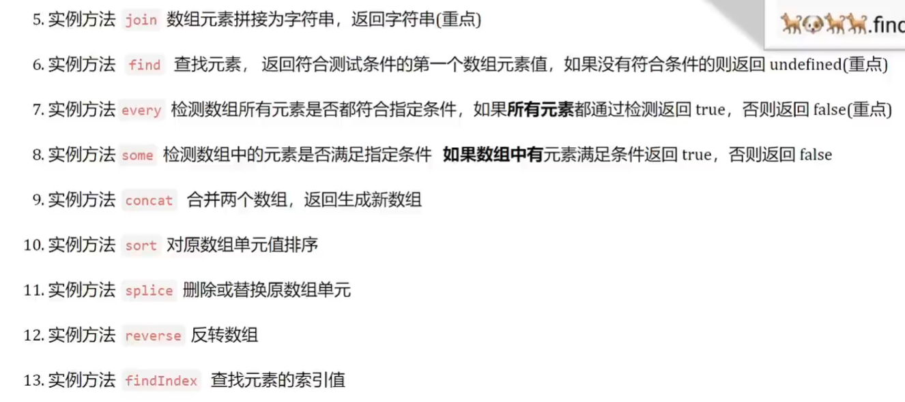
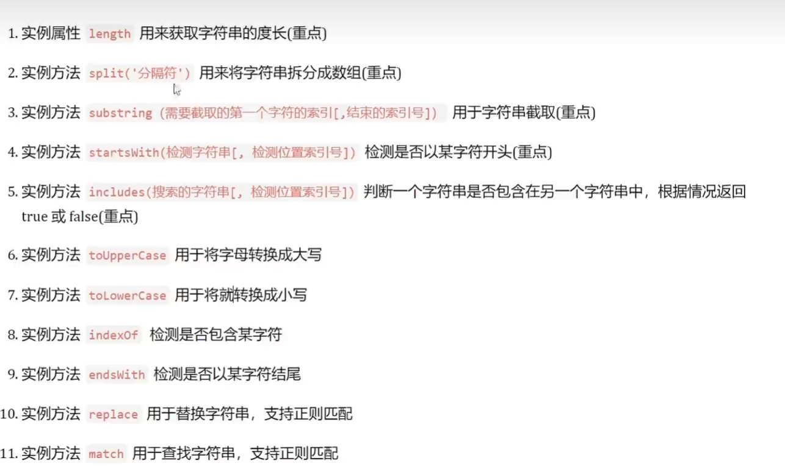

# 对象

## 1.创建对象

```js
1.const obj = {uname: "saury"}

2.const obj = new Object()
const obj = new Object({uname:"saury"})

3.构造函数创建对象
```

### 1.1构造函数创建对象

| 构造函数主要用来初始化对象

```js
function Pig(name, age, gender) {
    this.name = name 构造函数this指向new创建的新对象
    this.age = age
    this.gender = gender
}
const pig_1 = new Pig("saury", 12, "male")
```

### 1.2构造函数首字母大写(约定)

### 1.3只能通过new来使用

## 实例成员

| 通过构造函数创建的对象称为实例对象

实例成员包含实例方法和实例属性,属于实例的

## 静态成员

| 构造函数的属性和方法被称为静态成员,属于构造函数的

## 包装类型

```js
简单数据类型会自动装箱成复杂数据类型
const str = "hello" -> const str = new String("hello")
```

## 内置构造函数

### Object

Object是内置的构造函数，用于创建普通对象

```js
// Object.keys静态方法获取对象中的所有属性(key),返回数组
const o = {name: "saury", age: 12}
const arr = Object.keys(o)  arr['name', 'age']

// Object.assign(obj, origin)  拷贝对象，将origin拷贝给obj

const origin = {name:"saury", age:12}
Object.assign(origin, {gender: "male"}) // 追加属性
```

### Array

1. forEach 遍历数组,不返回数组
2. filter 过滤数组,返回新数组，返回的是筛选满足条件的数组元素
3. map 迭代数组，返回新数组，返回处理之后的数组元素
4. reduce 累加器，返回累计处理的结构，经常用于求和
5. every
6. some
7. concat
8. sort
9. splice
10. reverse
11. findIndex
12. from 把伪数组转成真数组


```js
arr.reduce(function(上一次值, 当前值){}, 起始值)
const num = [1,3,4]
const sum = arr.reduce(function(prev, cur) {
    return prev + cur
}, 0)
const sum = arr.reduce((prev, cur) => {prev + cur}, 10)

const div = document.querySelectorAll('div')
const t_div = Array.from(div)
```

### String

