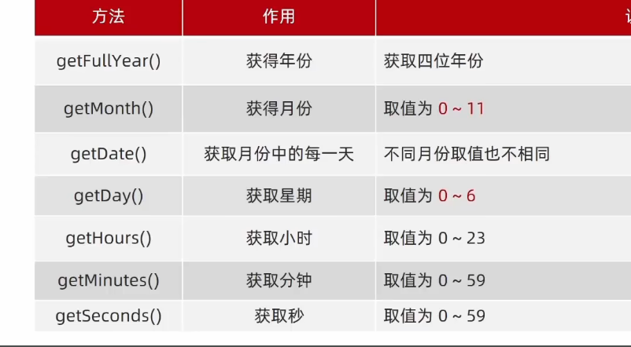

# 日期对象

## 实例化

```js
1.得到当前时间
let date = new Date() // 实例化

2.指定时间
let date = new Date('2024-4-14 9:00:30') // 倒计时用
```

## 日期对象方法



## 时间戳

1980年1月1日0时0分0秒起到现在的毫秒数

### 获取时间戳

* `getTime()`
* `+new Date()`
* `Date.now()` 只能获得当前时间的时间戳